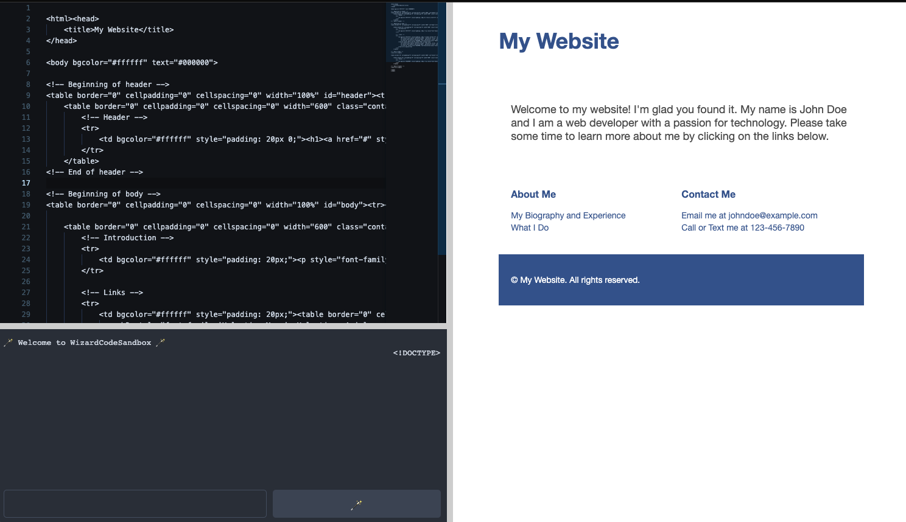

# wizardcoder-sandbox



Rapid prototyping AI code generation tool.

## prompt window

Submitting a prompt calls itself recursively by default and increments a version number with each response.

## monaco-editor-copilot

There is a built in toy copilot with the monaco-editor. To use press Command B.

## Development

```bash
pnpm i
pnpm dev
```

For best performance run WizardCoder locally. Currently running: https://huggingface.co/spaces/matthoffner/wizardcoder-ggml
